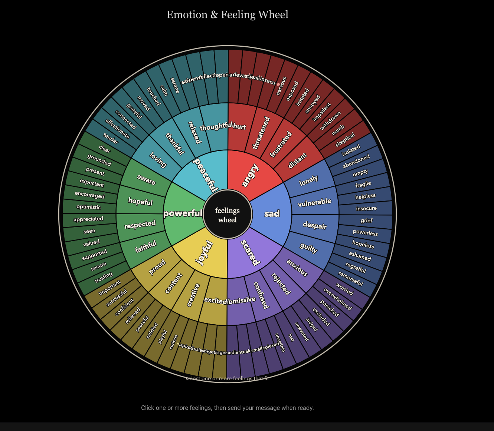

# RestReflect

A privacy-first voice companion for therapeutic reflection, powered by local AI. Everything runs on your device — no cloud, no data leaving your machine.

**[restreflect.com](https://restreflect.com)** · **[Demo Video](https://youtu.be/RU4YAyp-zxU)** · **[Paper (PDF)](paper/main.pdf)**

The core feature is **Reflect Mode** — the system mirrors back what you said before responding, implementing reflective listening from motivational interviewing. A 2200-particle visual canvas acts as the system's body language, and a multi-signal turn-taking engine treats silence as therapeutic space (4–16s adaptive thresholds vs. the industry's 300ms).



## Architecture

```
┌─────────────────────────────────────────────────────────┐
│                     RestReflect                         │
│              src/main.js (3 lines)                      │
│     Sets persona + app name, delegates to engine        │
└──────────┬─────────────────────┬────────────────────────┘
           │ require()           │ require()
┌──────────▼──────────┐  ┌──────▼─────────┐
│    mind-render       │  │  deep-reflect   │
│   (Electron engine)  │  │   (persona)     │
│                      │  │                 │
│  Ollama LLM chat     │  │  CBT system     │
│  Canvas particle viz │  │  prompt         │
│  Voice I/O           │  │  Guardrails     │
│  Persona system      │  │  (pre/post)     │
└──────────┬───────────┘  └─────────────────┘
           │ HTTP :5111
┌──────────▼──────────┐   ┌─────────────────┐
│    geno-voice        │   │    phq-9000      │
│  (voice pipeline)    │   │  (companion app) │
│                      │   │                  │
│  Whisper STT (MLX)   │   │  PHQ-9 screener  │
│  Kokoro TTS          │   │  Score tracking   │
│  Silence VAD         │   │  SwiftUI / iOS    │
└──────────────────────┘   └──────────────────┘
```

## Repos

| Repo | Role | Stack |
|------|------|-------|
| [RestReflect](https://github.com/42euge/RestReflect) | App wrapper | Electron (thin) |
| [mind-render](https://github.com/42euge/mind-render) | App engine | Electron, Ollama, Node.js |
| [deep-reflect](https://github.com/42euge/deep-reflect) | Therapeutic persona | Node.js, Python tests |
| [geno-voice](https://github.com/42euge/geno-voice) | Voice pipeline | Python, FastAPI, Whisper, Kokoro |
| [phq-9000](https://github.com/42euge/phq-9000) | PHQ-9 companion | SwiftUI, SwiftData |

## Quick Start

### Prerequisites

- Node.js 18+
- [Ollama](https://ollama.com) installed
- Python 3.10+ (for geno-voice)
- Apple Silicon Mac (for MLX-accelerated Whisper)

### Setup

```bash
# Install dependencies
npm install

# Pull the LLM model
ollama pull gemma4:e4b

# (Optional) Start the voice server for voice interaction
cd ../geno-voice
pip install -r requirements.txt
python server.py &

# Launch RestReflect
cd ../RestReflect
npm start
```

## How It Works

RestReflect is a thin Electron wrapper (3 lines of code) that configures [mind-render](https://github.com/42euge/mind-render) with the [deep-reflect](https://github.com/42euge/deep-reflect) therapeutic persona.

- **mind-render** provides the Electron shell: chat UI, particle canvas visualization, Ollama LLM orchestration, and voice I/O
- **deep-reflect** provides the persona: a ~500-line system prompt implementing CBT-based reflective listening with clinical safety guardrails
- **geno-voice** provides the voice pipeline: on-device STT (Whisper via MLX) and TTS (Kokoro) at `localhost:5111`
- **phq-9000** is a standalone iOS app for PHQ-9 depression self-assessment (future integration planned)

## License

MIT
